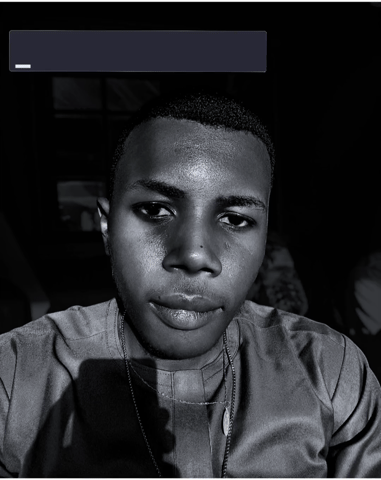

    

<h2 align="left">Hi 👋! My name is Ebube Ugwu and I'm from Nigeria</h2>

- 👋 Hi, I’m @Ebube-Ugwu
- 👀 I’m interested in programming and learning.
- 💞️ I currently work as a pharmacist and Java software developer.
- ☕ I’m an admin for the Naija Java User Group Community.
- 🧱 I’m part of the Nervos CKB builder community and currently learning how to develop apps on the CKB blockchain.
- 📫 [My website](https://ebubeugwu.dev)
- ⚡ I like close up magic and cardistry

###

###
## Tech Stack 

  
  
  
  
  
  
  
  
  
  

###

  
  

###

###

### You like?

I made this readme using [this](https://profile-readme-generator.com)

There's a cool tutorial on adding the snake animation by [Tobias](https://youtu.be/onUx22pgiBM?si=i0acl7suSS0rZsdQ)

 
<picture>
    <source media="{prefers-color-scheme: dark}" srcset="https://raw.githubusercontent.com/Ebube-Ugwu/Ebube-Ugwu/output/snake.svg" />
    <source media="{prefers-color-scheme: light}" srcset="https://raw.githubusercontent.com/Ebube-Ugwu/Ebube-Ugwu/output/snake.svg" />

</picture>

###
