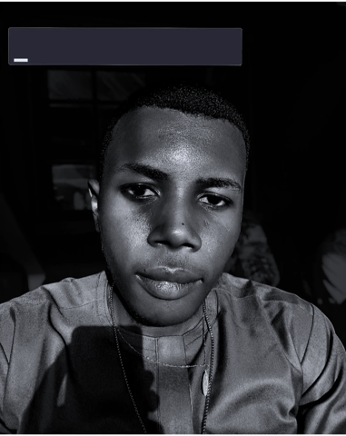

    

<h2 align="left">Hi 👋! My name is Ebube Ugwu and I'm from Nigeria</h2>

- 👋 Hi, I’m @Ebube-Ugwu
- 👀 I’m interested in programming and learning.
- 💞️ I’ currently work as a pharmacist💊.
- 📫 [My website](https://ebubeugwu.com)
- ⚡ I like close up magic and cardistry

  
  

###

###

  <i class="devicon-php-plain colored"></i>
  
  
    
  
  
  
  
  
  
  
  
  
  
  

###

  
  
  
  

###

 

###
